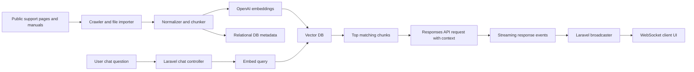
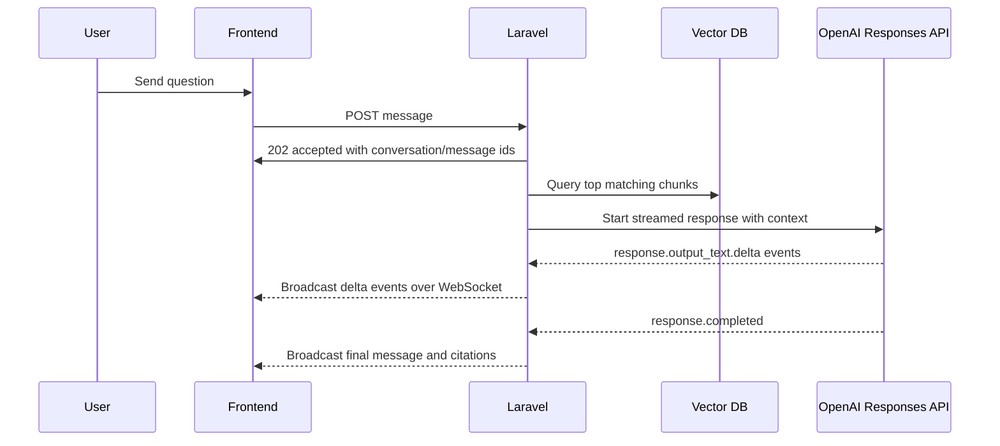

# E-commerce Product Support Assistant Plan

## 1. Project Summary

Build a portfolio-grade AI support assistant for a fictional electronics store that sells real consumer products.

The assistant should answer questions such as:

- "How do I reset these earbuds?"
- "Does this monitor support USB-C video?"
- "What is the return window for opened accessories?"
- "How do I update the firmware on this keyboard?"
- "Which charger is compatible with this laptop?"

The system will use:

- Laravel for the application backend and routing
- Goutte for crawling public support pages
- Guzzle for outbound HTTP requests
- OpenAI for embeddings and response generation
- A vector database for semantic retrieval
- Tailwind CSS for the UI
- Outfit as the primary font
- WebSockets plus streaming for a polished chat experience

This should feel like a real SaaS support tool, not a toy demo.

## 2. Product Direction

### Working concept

Create a fictional brand experience, for example:

- `SupportShelf AI`
- `CartCare Assistant`
- `ShopPilot Support`

The assistant is presented as the support layer for an online electronics store.

### Recommended niche

Start with a narrow but familiar catalog:

- Headphones and earbuds
- Keyboards and mice
- Webcams and monitors

Why this is a good starting point:

- People immediately understand the products
- Support docs are widely available
- Product manuals are text-rich
- Compatibility and troubleshooting questions are common
- Return and warranty questions feel realistic

### Final user experience goal

The user should be able to:

1. Open a beautiful chat interface
2. Ask a product or policy question
3. See the assistant stream an answer in real time
4. See sources attached to the answer
5. Trust that the answer came from actual manuals, support articles, and store policies

## 3. Core Features

### MVP features

- Crawl official product support pages
- Import PDF manuals and policy documents
- Chunk and embed the content
- Store vectors in a vector database
- Retrieve relevant context for each user question
- Use the OpenAI Responses API to generate grounded answers
- Persist conversations and messages
- Stream answers into the UI
- Show citations and source links

### Portfolio polish features

- WebSocket-powered live updates
- "Typing" and "searching sources" states
- Conversation history sidebar
- Suggested prompts by category
- Source panel with document title, section, and link
- Admin ingestion dashboard for crawl runs and file imports
- Filters for product category and brand
- Graceful empty states, loading states, and retry states

### Nice-to-have features

- Follow-up question suggestions
- Feedback buttons on answers
- Citation highlighting for the exact chunks used
- Search bar for browsing the knowledge base
- Scheduled recrawls
- Queue dashboard or ingestion activity feed

## 4. Scope Recommendation

Do not start with "all electronics" or "all e-commerce".

Start with:

- 15 to 25 products
- 2 to 4 brands
- 30 to 80 support articles
- 10 to 30 manuals or PDF guides
- 3 to 6 store policy documents

This is enough to demonstrate a real retrieval system without making ingestion messy too early.

## 5. Data Strategy

### 5.1 Source types

Use a mix of:

- Official vendor product pages
- Official vendor support articles
- Official vendor PDF manuals
- Your own store policy pages
- Warranty pages
- Shipping, returns, refund, and order FAQ pages

### 5.2 Good document categories

- Product setup guides
- Troubleshooting articles
- Firmware update instructions
- Compatibility notes
- Specifications
- Warranty terms
- Return policies
- Shipping FAQs

### 5.3 Rules for crawling

- Prefer public, official documentation
- Respect robots.txt and site terms where applicable
- Rate-limit crawls
- Store source URLs and crawl timestamps
- Store content hashes for deduplication
- Avoid crawling unrelated navigation pages, login pages, or search results

### 5.4 Recommended project framing

The cleanest portfolio framing is:

"A support assistant for an online consumer electronics store. It uses real vendor documentation and store policies to answer customer questions with citations."

That framing feels professional and avoids pretending you built a full retailer backend.

## 6. Architecture Overview



## 7. Recommended Stack

### Backend

- Laravel 13
- PHP 8.3
- MySQL or PostgreSQL for relational data
- Redis for queues, cache, and broadcasting support

### Crawling and ingestion

- Goutte-style crawling via Symfony HttpBrowser and DomCrawler
- Guzzle for HTTP requests
- Symfony DomCrawler through Goutte for extraction
- PDF parsing library for manuals and policy PDFs

### AI and retrieval

- OpenAI embeddings API
- OpenAI Responses API
- Weaviate for the vector database

### Realtime and UI

- Laravel Reverb for WebSockets
- Laravel broadcasting and events
- Laravel Echo on the frontend
- Tailwind CSS
- Blade plus lightweight frontend JavaScript
- Outfit font

### Suggested package checklist

Backend and infrastructure:

- `symfony/browser-kit`
- `symfony/http-client`
- `guzzlehttp/guzzle`
- `smalot/pdfparser` or another PDF text extraction package
- `laravel/reverb`
- Redis server plus either the PHP Redis extension or `predis/predis` if needed

Compatibility note:

- On Laravel 13 with Symfony 7, classic `fabpot/goutte` is not a clean fit, so the compatible implementation path is Symfony `HttpBrowser` plus `DomCrawler`.

Frontend:

- `alpinejs`
- `laravel-echo`
- `pusher-js`
- a small markdown renderer if assistant messages are rendered as markdown

## 8. Why Weaviate First

Weaviate is a strong default for this project because:

- It is serious enough for a portfolio
- It works well locally with Docker
- It supports metadata filtering cleanly
- It is easier to explain than a custom vector setup

Alternative:

- Pinecone if you want a managed hosted vector store

Recommendation:

- Use Weaviate for local development and first release
- Keep the vector access behind a Laravel service so Pinecone can be swapped in later

## 9. Recommended Application Modules

Plan the codebase around clear responsibilities.

### Backend modules

- `SourceRegistryService`
- `CrawlerService`
- `DocumentImportService`
- `DocumentNormalizer`
- `ChunkingService`
- `EmbeddingService`
- `VectorStoreService`
- `RetrievalService`
- `SupportAnswerService`
- `CitationFormatter`
- `ConversationService`

### Suggested app structure

```text
app/
  Actions/
  DTOs/
  Events/
  Http/
    Controllers/
  Jobs/
  Models/
  Services/
    Crawling/
    Documents/
    Embeddings/
    Retrieval/
    Responses/
    VectorStore/
```

## 10. Database Design

Use the relational database for application state and metadata, and use the vector DB for semantic search.

### Suggested relational tables

#### `products`

- id
- brand
- name
- slug
- category
- sku
- product_url
- support_url
- metadata json

#### `sources`

- id
- source_type
- domain
- url
- title
- checksum
- last_crawled_at
- status
- metadata json

#### `documents`

- id
- product_id nullable
- source_id nullable
- title
- document_type
- language
- storage_path nullable
- canonical_url nullable
- content_text longtext
- content_hash
- token_estimate
- metadata json

#### `document_chunks`

- id
- document_id
- chunk_index
- content
- token_estimate
- vector_id
- metadata json

#### `crawl_runs`

- id
- source_domain
- status
- started_at
- finished_at
- pages_discovered
- pages_ingested
- error_log text nullable

#### `conversations`

- id
- session_key or user_id
- title
- last_message_at
- metadata json

#### `messages`

- id
- conversation_id
- role
- content
- status
- citations json
- response_id nullable
- metadata json

### Why keep chunks in SQL too

Even though the vectors live in Weaviate, storing chunk text and metadata in SQL makes it easier to:

- debug retrieval
- show citations
- rebuild vectors
- inspect ingestion quality

## 11. Vector Schema

Each vectorized chunk should include metadata such as:

- `document_id`
- `source_id`
- `product_id`
- `brand`
- `category`
- `document_type`
- `title`
- `url`
- `chunk_index`
- `updated_at`

This will let us filter by:

- product
- category
- brand
- source type
- policy vs support docs

## 12. Ingestion Pipeline

### 12.1 Crawl pipeline

1. Register crawl targets in config or database
2. Fetch HTML pages with Guzzle
3. Parse and extract clean content with Goutte
4. Normalize text and remove junk
5. Save raw document record
6. Chunk content
7. Generate embeddings
8. Upsert vectors into Weaviate
9. Save chunk metadata locally
10. Mark crawl run as complete

### 12.2 File import pipeline

Use this for:

- manuals
- warranty PDFs
- return policy PDFs
- brand setup guides

Recommended flow:

1. Upload files into `storage/app/source-documents`
2. Parse text from each file
3. Normalize headings and whitespace
4. Chunk the extracted text
5. Embed and index
6. Tag with source metadata

### 12.3 Chunking strategy

Recommended starting point:

- 500 to 800 tokens per chunk
- 80 to 120 tokens overlap
- Keep section headings when possible
- Split by headings before falling back to paragraph size limits

Why:

- small enough for retrieval precision
- large enough to keep troubleshooting steps together

### 12.4 Deduplication rules

- Hash raw content
- Skip unchanged pages on recrawl
- Version documents when source text changes materially
- Keep historical crawl metadata for debugging

## 13. Retrieval Strategy

For every user question:

1. Save the user message
2. Create an embedding for the query
3. Search Weaviate for top chunks
4. Apply metadata filters if the user is clearly asking about a product or policy
5. Rerank or trim to the most relevant chunks
6. Build a compact context block
7. Send the user question plus retrieved context to the Responses API
8. Stream the answer back to the UI
9. Save citations with the final assistant message

### Retrieval rules

- Prefer support docs and manuals over marketing copy
- Prefer policy docs for returns and warranty questions
- Limit context to the best 6 to 10 chunks
- Include source titles and URLs in the prompt context
- Refuse to guess when there is insufficient evidence

## 14. Response Generation Strategy

The assistant should be grounded, concise, and helpful.

### System behavior

The assistant should:

- answer only from retrieved context
- say when the knowledge base does not contain enough information
- avoid inventing product specs
- cite sources clearly
- prefer step-by-step answers for troubleshooting
- separate policy answers from product setup answers

### Response style

- warm and professional
- plain language
- short paragraphs
- numbered steps for troubleshooting
- clear source references

### Good answer format

- short direct answer
- relevant steps or explanation
- "Sources" list at the end

## 15. Responses API Plan

Use the OpenAI Responses API as the final answering layer.

Recommended flow:

1. Retrieve relevant chunks from the vector DB
2. Build a structured input payload
3. Include:
   - system instructions
   - user question
   - retrieved context block
   - citation metadata
4. Enable streaming
5. Consume streaming events on the Laravel backend
6. Broadcast deltas to the frontend over WebSockets
7. Store the completed final answer in the database

### Important implementation note

OpenAI streaming is delivered as a stream of events from the Responses API.

The clean UX approach for this app is:

- Laravel consumes the OpenAI stream
- Laravel rebroadcasts message deltas over Reverb
- The frontend subscribes to a conversation channel and renders tokens as they arrive

That gives us both:

- real streaming
- real WebSockets

## 16. Real-Time Chat Architecture

### 16.1 Why use WebSockets here

WebSockets are not just for "typing..." effects.

They are useful for:

- streamed message deltas
- indexing progress updates
- live conversation updates across tabs
- assistant status changes
- retry and completion events

### 16.2 Proposed message lifecycle



### 16.3 Suggested event types

- `conversation.message.started`
- `conversation.message.delta`
- `conversation.message.completed`
- `conversation.message.failed`
- `conversation.retrieval.started`
- `conversation.retrieval.completed`
- `ingestion.run.updated`

## 17. Chat UX Plan

The chat interface needs to feel premium and calm, not generic.

### 17.1 Visual direction

Recommended design direction:

- bright, editorial, modern
- soft neutrals with one strong accent color
- rounded cards
- layered panels
- subtle gradients and shadows
- strong typography using Outfit

Avoid:

- default white dashboard look
- purple-on-white AI template styling
- cluttered nav
- overly dark hacker aesthetic

### 17.2 Suggested design tokens

You can adapt these later, but this is a strong starting point:

- Background: warm off-white
- Surface: white with slight transparency
- Text: deep charcoal
- Accent: cobalt or deep teal
- Success: muted green
- Warning: amber
- Borders: soft neutral gray

Example mood:

- background `#F6F3EE`
- surface `#FFFFFF`
- text `#18181B`
- accent `#1459C8`
- accent-soft `#DCE9FF`
- border `#E7E2DA`

### 17.3 Layout

### Desktop

- Left sidebar for conversation history and filters
- Main center column for messages
- Right panel for sources and product details
- Sticky composer at the bottom

### Mobile

- Full-width chat
- Slide-over source drawer
- Compact top bar
- Sticky bottom composer

### 17.4 Key UI components

- Landing hero with sample prompts
- Conversation list
- Message bubbles
- Streaming assistant bubble
- Typing/searching indicator
- Source chips under each assistant answer
- Expandable source drawer
- Product context card
- Status toasts for ingestion and errors
- Empty state cards for first use

### 17.5 Interaction details

- Auto-scroll while streaming, unless the user scrolls up
- Animated cursor while text is streaming
- "Searching manuals..." state before first token
- Copy answer button
- Retry message button
- "Show sources" toggle
- Keyboard shortcut to focus the composer
- Disable duplicate submits while a message is in flight

### 17.6 Typography

- Use Outfit for all UI text
- Use stronger weight contrast for titles and section labels
- Keep message body comfortable and highly readable
- Avoid tiny text in metadata chips

### 17.7 Tailwind plan

Use Tailwind with a small design system:

- CSS variables for colors, spacing, shadows, and radii
- utility classes for layout
- extracted Blade components for reusable UI blocks
- one custom animation file for streaming and reveal effects

## 18. Frontend Implementation Approach

Stay Laravel-first, but still make the UI feel dynamic.

### Recommended frontend approach

- Blade for page structure
- Tailwind for styling
- small Vite-powered JavaScript modules for chat behavior
- Alpine.js or lightweight vanilla modules for UI interactions
- Laravel Echo for WebSocket subscriptions

Why this is a good fit:

- keeps the project clearly Laravel-centered
- avoids unnecessary SPA complexity
- still supports a polished chat experience

If you later want a more app-like feel, the UI can evolve to Inertia or Vue, but it is not required for a strong first version.

## 19. Routes and Endpoints

### Web routes

- `GET /`
- `GET /chat`
- `GET /admin/ingestion`

### API routes

- `GET /api/conversations`
- `POST /api/conversations`
- `GET /api/conversations/{conversation}`
- `POST /api/conversations/{conversation}/messages`
- `GET /api/conversations/{conversation}/messages`
- `POST /api/ingestion/crawls`
- `POST /api/ingestion/files`
- `GET /api/ingestion/runs`

### Broadcasting channels

- `private-conversation.{id}`
- `private-ingestion.runs`

## 20. Suggested Laravel Jobs

- `RunCrawlJob`
- `ImportDocumentJob`
- `ChunkDocumentJob`
- `EmbedChunksJob`
- `SyncVectorsJob`
- `GenerateAssistantReplyJob`
- `BroadcastMessageDeltaJob`

Use queues aggressively. Ingestion and answer generation should not block the request cycle.

## 21. Suggested Controllers

- `ChatPageController`
- `ConversationController`
- `MessageController`
- `IngestionController`
- `SourceController`

## 22. Suggested Events

- `AssistantMessageStarted`
- `AssistantMessageDeltaReceived`
- `AssistantMessageCompleted`
- `AssistantMessageFailed`
- `IngestionRunUpdated`

## 23. Suggested Config Files

- `config/openai.php`
- `config/vector-store.php`
- `config/crawling.php`
- `config/support-assistant.php`

## 24. Environment Variables

Likely env variables:

- `OPENAI_API_KEY`
- `OPENAI_RESPONSES_MODEL`
- `OPENAI_EMBEDDING_MODEL`
- `VECTOR_STORE_DRIVER`
- `WEAVIATE_URL`
- `WEAVIATE_API_KEY`
- `CRAWLER_USER_AGENT`
- `CRAWLER_RATE_LIMIT_MS`
- `REVERB_APP_ID`
- `REVERB_APP_KEY`
- `REVERB_APP_SECRET`
- `REVERB_HOST`
- `REVERB_PORT`
- `QUEUE_CONNECTION`
- `CACHE_STORE`
- `BROADCAST_CONNECTION`

## 25. Prompting Plan

The prompt should make the assistant behave like a support expert grounded in documents.

### System prompt goals

- answer using retrieved evidence only
- do not invent unsupported details
- tell the user when context is insufficient
- cite the sources used
- prefer clarity over verbosity
- distinguish policy answers from troubleshooting steps

### Context payload structure

Each retrieved chunk should include:

- source title
- source URL
- document type
- chunk text

This will make citations easier and debugging far cleaner.

## 26. Citation Strategy

Every assistant answer should include citations.

### Recommended citation format in UI

- small source pills under the response
- clicking a pill opens the source drawer
- drawer shows title, URL, document type, and excerpt

### Recommended citation format in storage

Store:

- `document_id`
- `chunk_id`
- `title`
- `url`
- `document_type`
- `excerpt`

## 27. Admin and Ingestion Dashboard

This is a great portfolio differentiator.

### Dashboard should show

- crawl runs
- pages discovered
- pages ingested
- file imports
- failed documents
- last sync time
- total products
- total indexed chunks

### Optional dashboard actions

- recrawl a source
- upload a manual
- rebuild vectors for a document
- re-run failed ingestion

## 28. Error Handling Plan

### User-facing error states

- network error sending message
- assistant failed to respond
- no relevant sources found
- source temporarily unavailable

### Ingestion error states

- crawl blocked
- PDF parse failed
- embedding request failed
- vector sync failed

### Recovery strategies

- retry failed jobs
- log failures with source ids
- mark documents as failed instead of dropping them silently

## 29. Logging and Observability

Track:

- ingestion duration
- tokens embedded
- tokens generated
- retrieval hit counts
- average answer latency
- failed crawl URLs
- empty retrieval cases

These metrics help tell the story of a real production-minded application.

## 30. Security and Safety

- validate and sanitize URLs for crawl targets
- limit crawl domains
- protect admin ingestion routes
- rate-limit public chat endpoints
- store only approved document sources
- add abuse protection on message submission
- avoid claiming official support if this is a demo portfolio app

## 31. Testing Plan

### Backend tests

- chunking behavior
- retrieval filtering
- citation formatting
- controller validation
- message persistence
- Responses API service mocked integration

### Realtime tests

- event broadcasting
- delta ordering
- completion state handling

### UI checks

- chat input behavior
- stream rendering
- mobile responsiveness
- source drawer behavior

## 32. Delivery Phases

## Phase 1: Foundation

- install crawling, realtime, and vector dependencies
- configure database, queue, cache, and broadcasting
- set up Outfit font and base Tailwind tokens
- create initial app shell and route structure

## Phase 2: Data ingestion

- define sources
- build crawler service
- add file import flow
- normalize and store documents

## Phase 3: Embeddings and retrieval

- add chunking
- add OpenAI embedding service
- add Weaviate sync
- add top-k retrieval

## Phase 4: Chat backend

- create conversation and message models
- build message submission endpoint
- implement grounded Responses API orchestration
- persist final answers and citations

## Phase 5: Realtime streaming

- install Reverb and Echo
- broadcast retrieval and message stream events
- render deltas live in the chat UI

## Phase 6: UI polish

- refine layout and motion
- add source drawer
- add conversation history
- add loading, error, and empty states

## Phase 7: Admin tools

- ingestion dashboard
- recrawl actions
- import status views

## Phase 8: Final polish

- testing pass
- responsive pass
- deployment setup
- README, screenshots, and demo script

## 33. Definition of Done

The project is portfolio-ready when:

- users can ask grounded product and policy questions
- answers stream live in the interface
- answers show citations
- ingestion supports both crawled pages and uploaded manuals
- the UI feels designed, not scaffolded
- there is an admin view for ingestion
- the README clearly explains the architecture

## 34. Recommended First Build Slice

Build this narrow vertical first:

- one category
- three products
- five support articles
- two manuals
- one return policy
- one warranty page

Then prove the full loop:

1. ingest source
2. chunk and embed
3. retrieve context
4. stream answer
5. show citations

After that, expand the dataset and polish the UI.

## 35. Suggested Milestone Order

1. Set up app shell, Tailwind theme, and Outfit font
2. Add conversation and message persistence
3. Build crawler and manual importer
4. Add chunking and embeddings
5. Add Weaviate indexing and retrieval
6. Build Responses API orchestration
7. Add streaming plus WebSockets
8. Add citations and source drawer
9. Build ingestion dashboard
10. Polish visuals, copy, and portfolio presentation

## 36. Reference Docs

- OpenAI Responses streaming guide: https://platform.openai.com/docs/guides/streaming
- OpenAI embeddings guide: https://platform.openai.com/docs/guides/embeddings
- OpenAI embeddings API reference: https://platform.openai.com/docs/api-reference/embeddings

## 37. Final Recommendation

Build this as a polished support assistant for a fictional electronics storefront using real product documentation.

Keep the first release narrow, make the retrieval trustworthy, and spend real effort on the chat experience.

The strongest portfolio version of this project is not "the smartest chatbot".

It is:

- grounded
- fast
- visually intentional
- clearly architected
- backed by real documents
- pleasant to use
